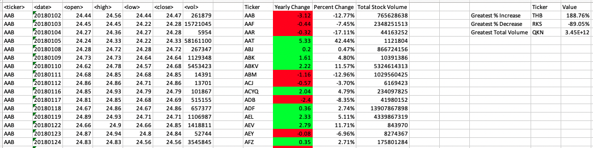
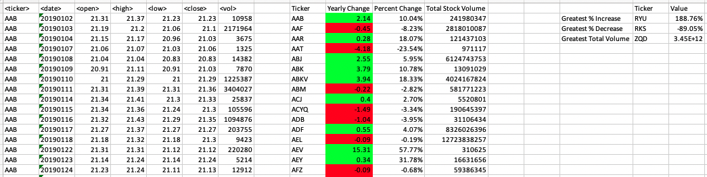
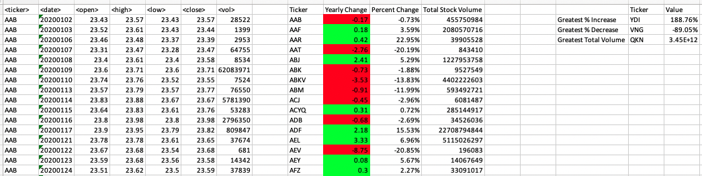

# VBA-Stock-Analysis
In this project, I used VBA scripting to analyze generated stock market data. I created a script that loops through all the stocks for one year and outputs the following information:  
-The ticker symbol.  
-Yearly change from opening price at the beginning of a given year to the closing price at the end of that year.  
-The percent change from opening price at the beginning of a given year to the closing price at the end of that year.  
-The total stock volume of the stock.  

I also added functionality to the script to return the stock with the "Greatest % increase", "Greatest % decrease", and "Greatest total volume". 
Some screenshots of the spreadsheets are below.

